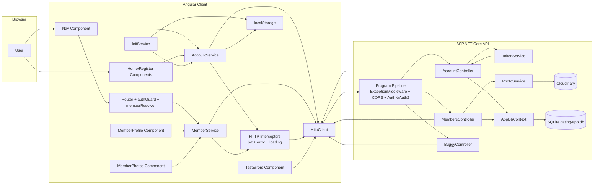
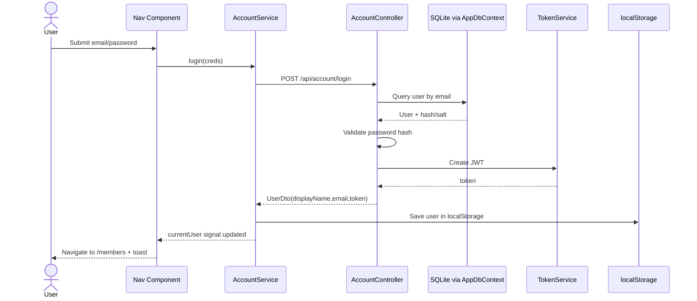
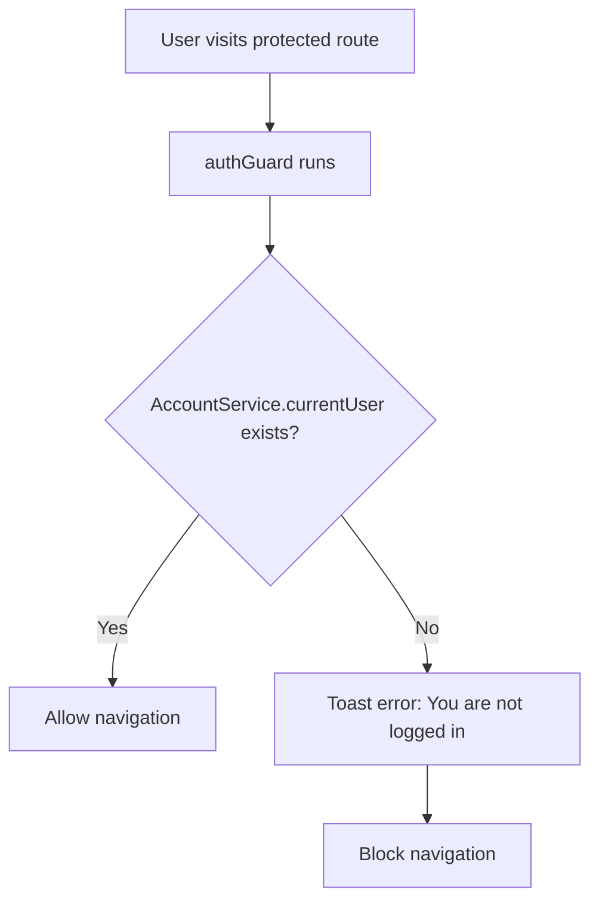
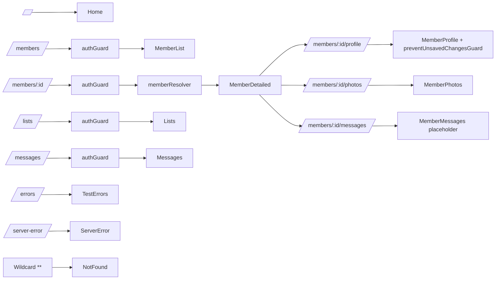
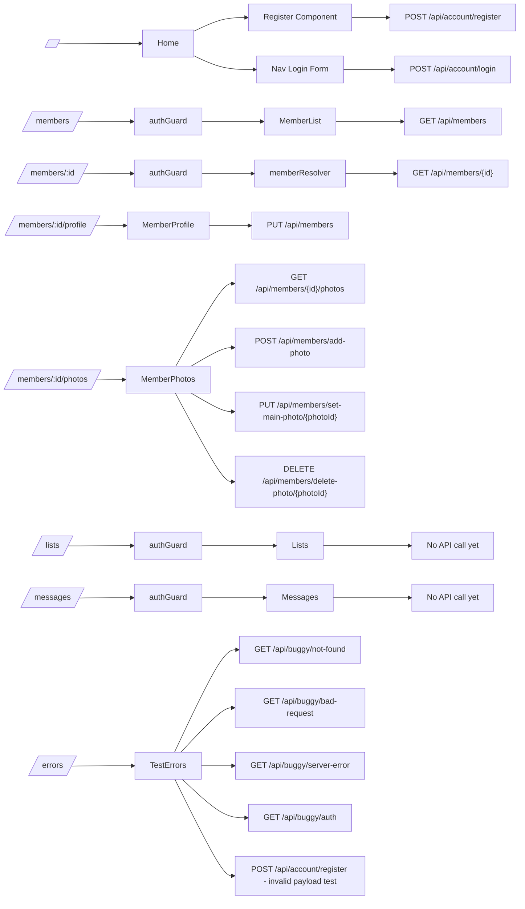
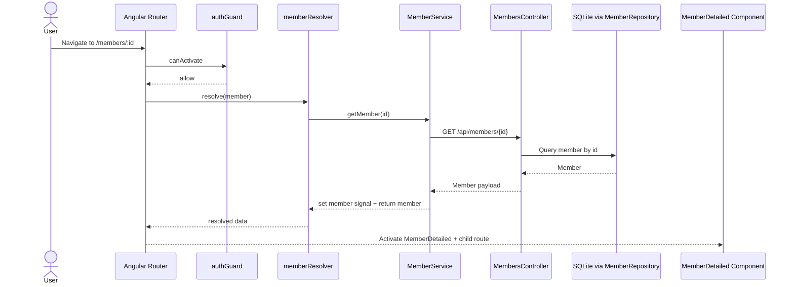
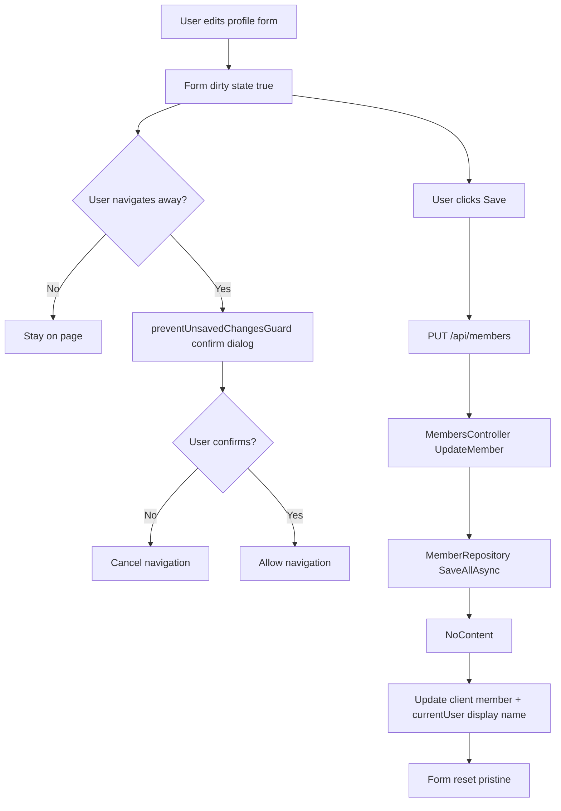
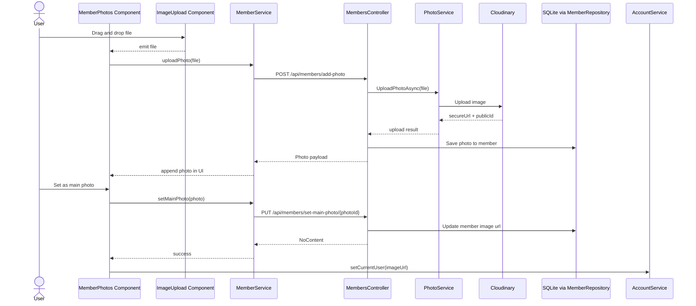

# Code Interaction Map

This document maps how the current codebase parts interact.

## Diagram Key

Use this legend for all charts in this file.

| Shape in chart | Meaning in this project |
| --- | --- |
| Rectangle | Component, service, controller, or process step |
| Slanted route box | URL route path |
| Cylinder | Database storage (SQLite) |
| Diamond | Decision point / condition |
| Subgraph container | System boundary (Browser, Client, API) |
| Arrow | Direction of dependency, call, or flow |

## 1) High-Level Architecture

## 2) Auth Login Sequence

## 3) Route Protection Flow

## 4) Route to Component Map

## 5) Route to API Dependency Map

## 6) Member Detail Data Load Sequence

## 7) Profile Update + Unsaved Guard Flow

## 8) Photo Upload and Main Photo Flow

